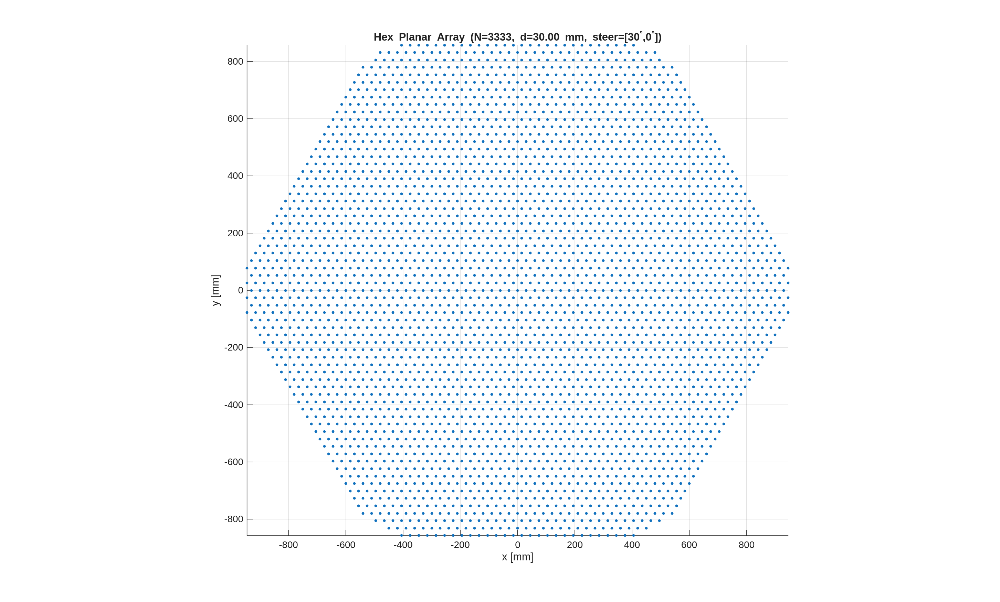
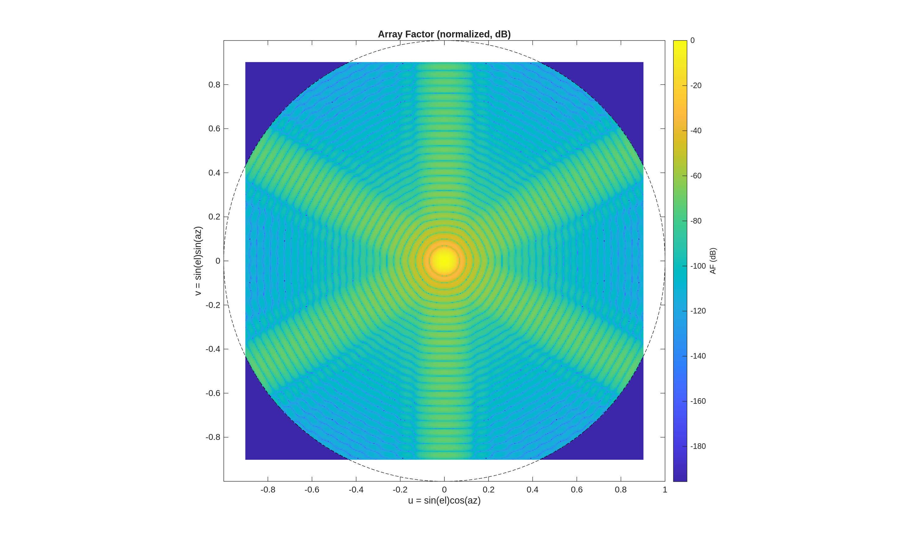
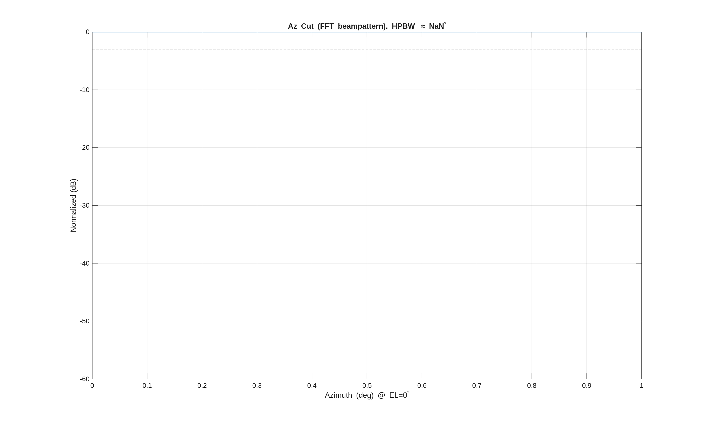
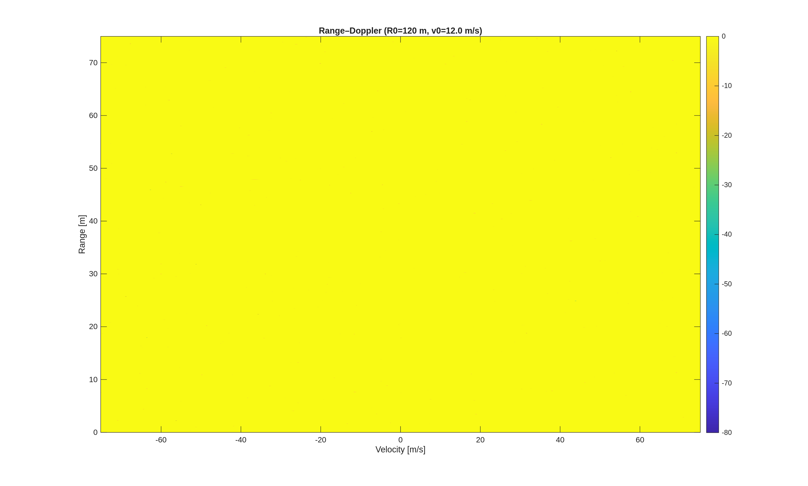
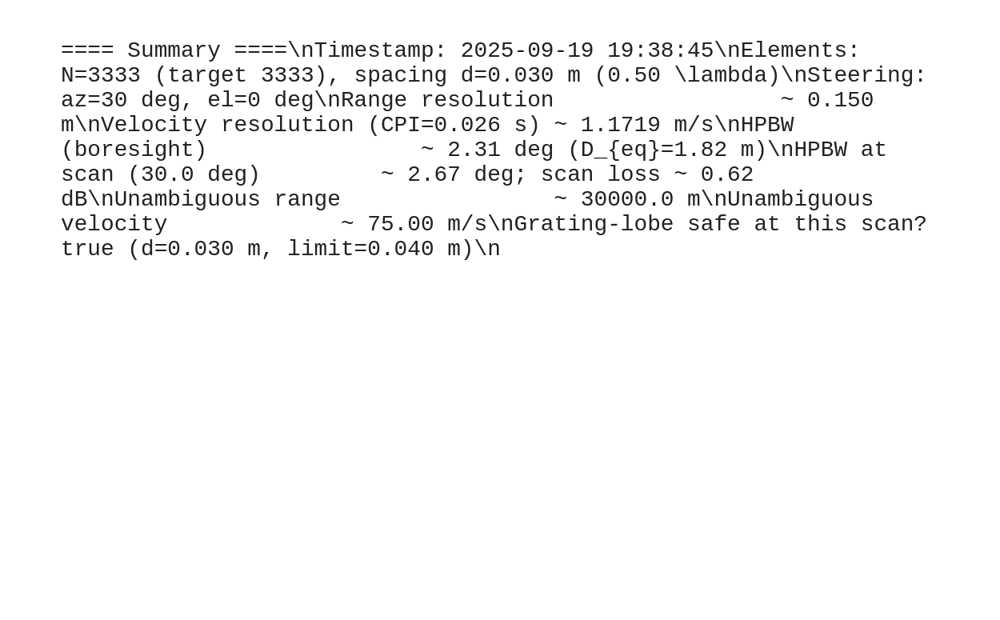

# Phased-Array Radar Simulation (Hex Planar Array, toolbox‑free)

MATLAB simulation & visualization for an electronically steered **hexagonal planar** phased array (triangular lattice).
It generates:
- Hex array element layout (defaults to **3,333** elements)
- 2‑D *u–v* array‑factor heatmap + azimuth cut
- 3‑D beampattern sampled over azimuth/elevation
- Aperture‑FFT beampattern with **exact HPBW** extraction
- FMCW chirp visualization + DIY STFT (*no toolboxes*)
- Toy single‑target **Range–Doppler** map
- A run **summary** saved to `results/summary.txt` and `results/summary.pdf`

All figures are auto‑saved to `results/` as **PNG**, **PDF**, and **FIG**.

## Requirements
- MATLAB R2018+ (no toolboxes required). If `exportgraphics` is available (R2020a+), it will be used; otherwise we fall back to `print`/`saveas`.

## Quick start
```matlab
cd matlab
run_demo   % or: Radar_theoretical_max_accuracy_formulas_waveforms
```
Outputs will appear in `../results/`. The Command Window logs each saved file with `[SAVE]` lines.

## Key parameters
Edit near the top of `matlab/Radar_theoretical_max_accuracy_formulas_waveforms.m`:
- **RF:** `fc`, `B`, `PRF`, `Npulses`
- **Array:** `N_target`, spacing `d` (defaults to λ/2), steering `scanAz_deg`, `scanEl_deg`
- **Taper:** `taper.type = 'none' | 'raisedcos'`, `taper.power`
- **Visual toggles:** `doSpectrogram`, `doRangeDoppler`, `doBeampattern3D`, `doFFTBeampattern`
- **Saving:** set `useTimestampSubfolder = true` to write into `results/<timestamp>/`

## Repo layout
```
.
├─ README.md
├─ LICENSE
├─ .gitignore
├─ results/            # outputs land here (ignored by git)
└─ matlab/
   ├─ Radar_theoretical_max_accuracy_formulas_waveforms.m
   └─ run_demo.m
```

## Notes
- `results/` is git‑ignored to keep the repo small. Delete that rule if you want example outputs tracked.
- HPBW from the FFT beampattern is reported in the Command Window and appended to `results/summary.txt`.

---

## CI status


## Example results
| Array face | u–v beampattern | Az cut (HPBW) |
|---|---|---|
|  |  |  |

| Range–Doppler | Summary |
|---|---|
|  |  |
